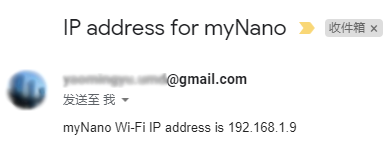
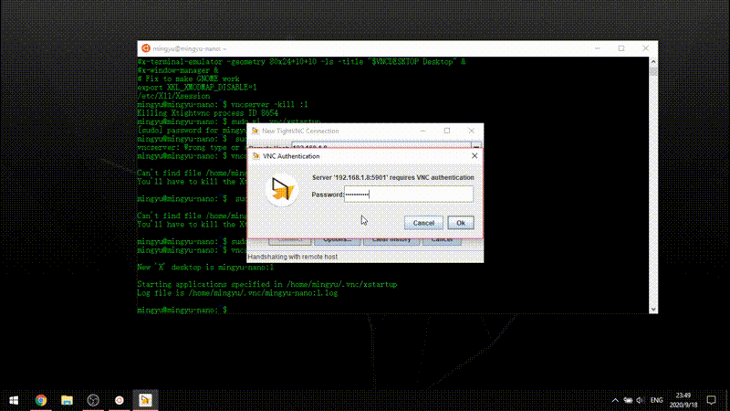
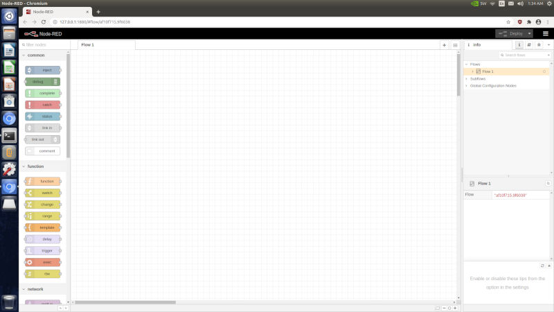
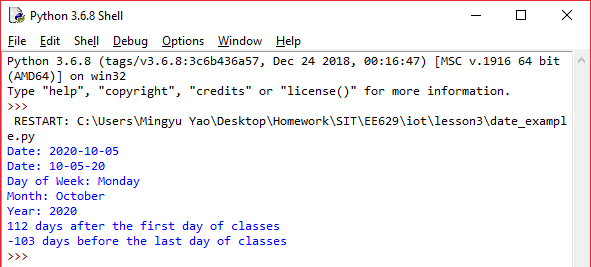
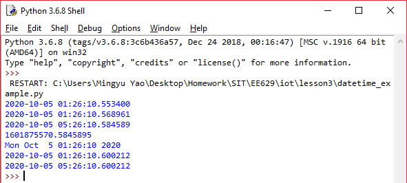
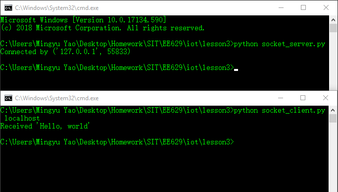
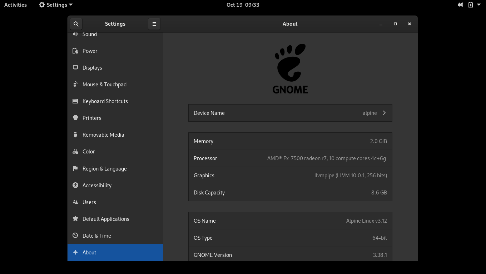
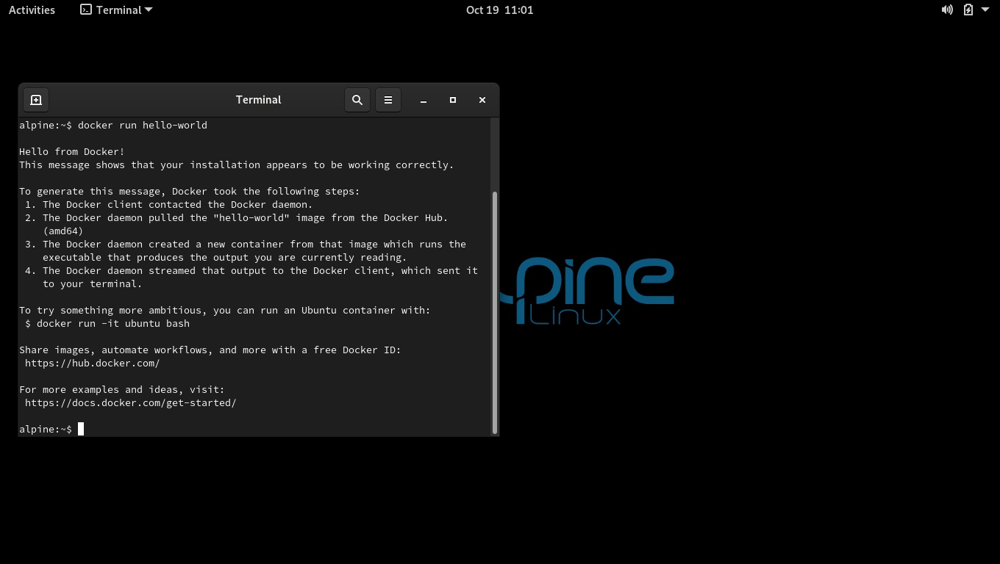
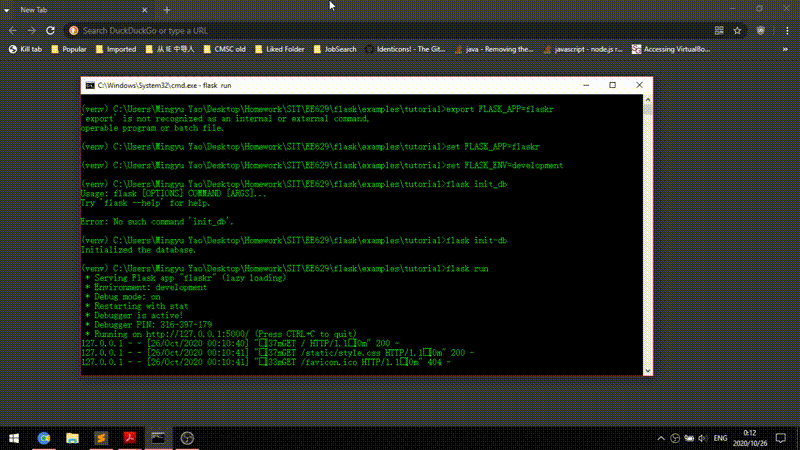
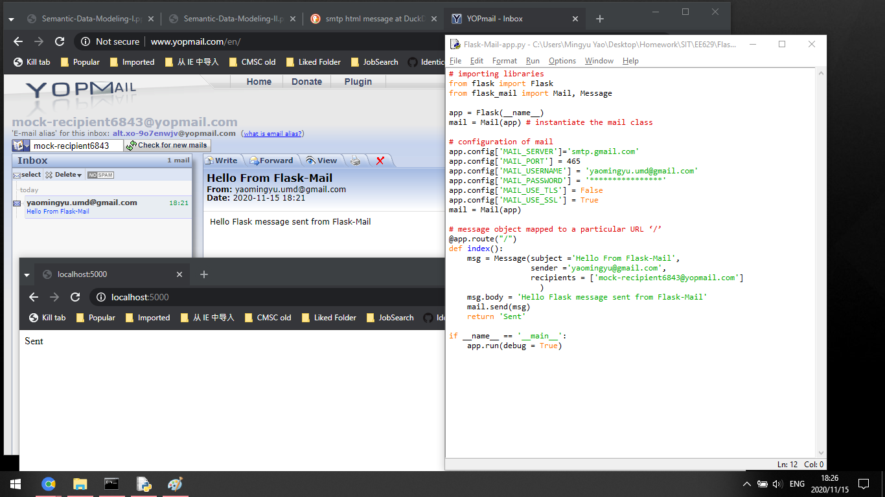

# Weekly Report
I will post reports under this folder

Tasks:
 - [x] [Lesson 1](./#Lesson-1)
 - [x] [Lesson 2](./#Lesson-2)
 - [x] [Lesson 3](./#Lesson-3)
 - [x] [Lesson 4](./#Lesson-4)
 - [x] [Lesson 5](./#Lesson-5)
 - [x] [Lesson 6](./#Lesson-6)
 - [x] Lesson 7
 - [x] Lesson 8
 - [x] [Lesson 9](./#Lesson-9)
 - [ ] Lesson 10
 
 # Lesson 1
 *Lab 1c: Startup Mailer*
 
 Sending ip address from myNano device:
 

*lab 1d: VNC and SSH*

Connect to myNano via VNC.

# Lesson 2
*Lab 2h: Install and Run Flask app*

*Lab 2n: Install and run node-red*

# Lesson 3

*Lab 3m: testing date/datetime python script on local machine*

*Lab 3j: connect socket client to socket server*

# Lesson 4

* Updated Github Pages*

* Learn more about [flask](https://flask.palletsprojects.com/en/1.1.x/) *

# Lesson 5

*Lab 5a: Alpine Linux in Virtual box*

*Lab 5b: Install Docker in Alpine Linux*

# Lesson 6
*Lab 6a: Flaskr demo - A complete Flask blogging app*

# Lesson 9
*Lab 9a: Flask mail demo - A Flask emailing app*

