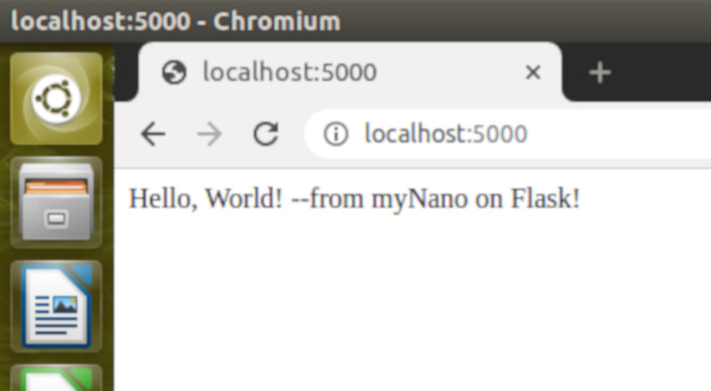

# Weekly Report
I will post reports under this folder

Tasks:
 - [x] [Lesson 1](./#Lesson-1)
 - [x] [Lesson 2](./#Lesson-2)
 - [ ] Lesson 3
 - [ ] Lesson 4
 - [ ] Lesson 5
 - [ ] Lesson 6
 - [ ] Lesson 7
 - [ ] Lesson 8
 - [ ] Lesson 9
 - [ ] Lesson 10
 
 # Lesson 1
 *Lab 1c: Startup Mailer*
 
 Sending ip address from myNano device:
 

*lab 1d: VNC and SSH*

Connect to myNano via VNC.

# Lesson 2
*Lab 2h: Install and Run Flask app*

*Lab 2n: Install and run node-red

