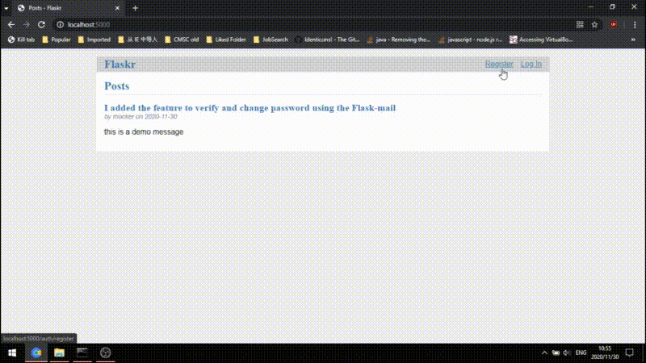

# Final Project for Internet of Things
## Title: Smart Flask Mailer
### Project Overview
I want to create a Flask app that read and process user data and send email to user on appropriate occation. I think this is very useful that a user can passing arguments to its IoT device through web and getting timely notification from email and I'd like to see the outcome of combining the two.
The project are goint to use Flask with Flask-Mail, sqlite3 or Flask-PyMongo depend on my choice of database. Detailed implementation will come up in the following week.

### Project Setup
	pip install flask
	pip install flask-mail
	pip install flask-PyMongo | pip install sqlite3
	#### for Windows
	> set FLASK_APP=smart_flask_mailer
    > set FLASK_ENV=development
	#### for Linux
	$ export FLASK_APP=smart_flask_mailer
    $ export FLASK_ENV=development
	flask init-db
	flask run

### Project Demo & Issue Tracking
Completed the API for email verification and password reset of the app.

:octocat: Working on integrating it with "flask-mail" ...

### Contribution & License
I'm planning to release under ISC License.

----
Tasks:
- [x] Project Overview
- [x] Project Setup
- [ ] Project Demo & Issue Tracking
- [ ] Contribution & License
