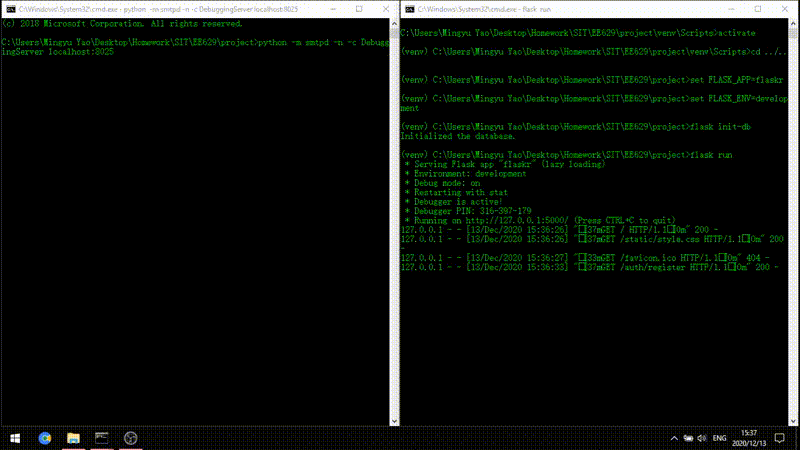

# Final Project for Internet of Things
## Title: Smart Flask Mailer
### Project Overview
I want to create a Flask app that read and process user data and send email to user on appropriate occation. I think this is very useful that a user can passing arguments to its IoT device through web and getting timely notification from email and I'd like to see the outcome of combining the two.
The project are goint to use Flask and a smtp server to add the email verification capability to the simple Flaskr app.

### Project Setup
	#setting up venv (virtual environment) with
	(venv) pip install flask
	(venv) pip install sqlite3
#### for Windows
	> set FLASK_APP=flaskr
   	> set FLASK_ENV=development
#### for Linux
	$ export FLASK_APP=flaskr
   	$ export FLASK_ENV=development
	#### start the local smtp server (DebuggingServer) in a separate terminal to receive the email message
	(venv) python -m smtpd -n -c DebuggingServer localhost:8025
	#### initialize the database if running the first time.
	flask init-db
	flask run

### Project Demo & Issue Tracking
Completed the API for email verification and password reset of the app.

:octocat: I used the smtplib instead of Flask-Mail to use the mail functionality without reconfigure the Flask app context ...

### Contribution & License
I'm planning to release under ISC License.

----
Tasks:
- [x] Project Overview
- [x] Project Setup
- [x] Project Demo & Issue Tracking
- [x] Contribution & License
